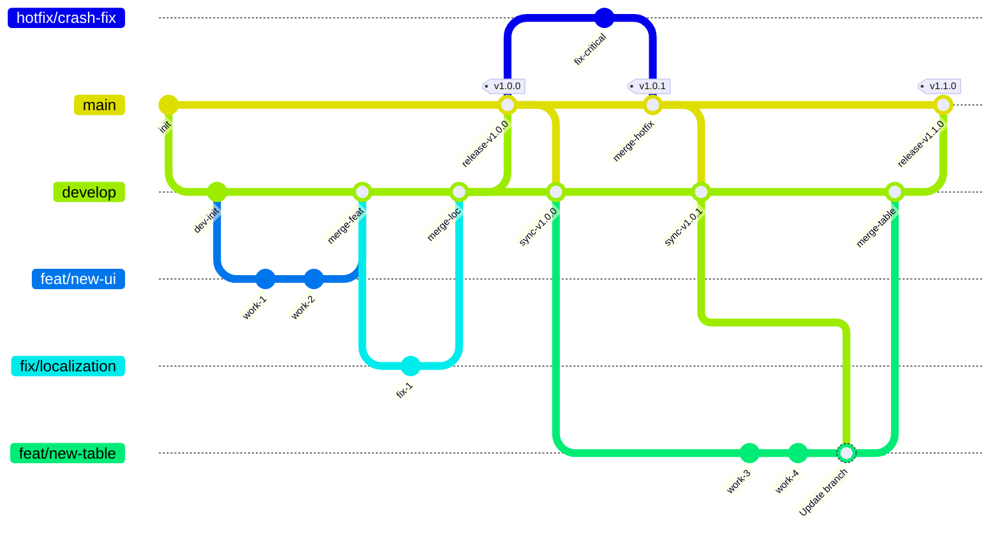

# How to contribute

## Branching strategy

The following branches are the primary branches:

- main
- develop
- hotfix/\*\*
- \*\* (e.g., feature/**)

The relationships between branches are as follows:

### main

This is the release version.  
All releases are created from this branch. You cannot commit directly to this branch. Also, you cannot merge branches other than the develop branch or hotfix/\*\* branches into it.

### develop

This is the Canary version.  
All implementations are merged into this branch. There is a possibility that bugs still exist. However, since we perform integration tests before merging, bugs should be rare.

### hotfix/\*\*

This is a working branch used when a critical bug is found after a release.  
It allows you to skip the `develop` branch and merge directly into `main`. Please create this branch from the `main` branch and create a Pull Request directly to the `main` branch.

### \*\* (eg. feature/\*\*)

This is a standard working branch for adding features, fixing bugs or other tasks.  
Please create this branch from the `develop` branch and create a Pull Request to the `develop` branch.

Before creating a Pull Request, please merge the latest changes from `develop` and ensure all tests pass.  
Do not implement multiple features in a single branch. Please divide the work by feature as finely as possible.  
Small code units make code reviews easier and help the reviewer!
